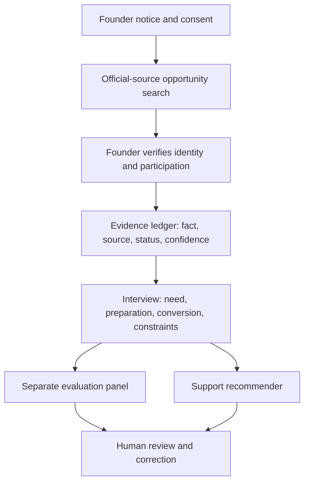

# Germany–United States founder networks, training and access overview

**Version:** 1.0  
**Information checked:** 21 July 2026  
**Scope:** Germany, the United States and practical Germany–U.S. market-entry bridges  
**Purpose:** Help an interview agent identify relevant founder support, verify whether a founder actually used it, and recommend next opportunities without mistaking network privilege for founder quality.

> **Important boundary:** A founder's presence in a prestigious network is not a validated psychological trait and is not proof of future success. Ecosystem information belongs in a separate evidence-and-support panel. The interview may evaluate how a founder selects and converts relevant resources, but it must not reward prestige, wealth, elite-university access or mere social proximity.

## 1. Executive overview

Germany and the United States provide overlapping but differently organized support:

| Dimension | Germany | United States |
|---|---|---|
| Public first stop | Gründerplattform, regional hubs and chambers | SBA Resource Partners and SBA Learning |
| Research commercialization | EXIST, Startup Factories, Fraunhofer Venture/AHEAD and university transfer offices | NSF I-Corps, SBIR/STTR, NIH SEED, federal laboratories and university programs |
| Angel route | BAND and regional networks such as BayStartUP | Angel Capital Association directory and local angel groups |
| Accelerator route | Public/private hubs, HTGF-linked support, German Accelerator and sector programs | YC, Techstars, MassChallenge, 500 Global, StartX and many regional programs |
| Open training/community | Gründerplattform and regional ecosystem events | SBA/SCORE, YC Startup School, Startup Weekend and Startup Grind |
| Typical access pattern | Strong institutional and public-program pathways; eligibility often tied to Germany, a university or research origin | Highly decentralized; public programs coexist with selective, equity-taking accelerators and private membership networks |
| Cross-border bridge | German Accelerator U.S. programs | SelectUSA Tech and state/local economic-development organizations |

The agent should answer two separate questions:

1. **What can this founder access now?** This is an opportunity-matching question.
2. **What did this founder actually do?** This is a verification question.

Never infer the second answer from the first.

## 2. A precise access and participation vocabulary

Use the following status ladder for every program, network or event:

| Code | Status | Required meaning | Example evidence |
|---|---|---|---|
| **O** | Openly available | Public material, event or course can be used without competitive admission | Public course page or open registration page |
| **E** | Apparently eligible | Published criteria appear to fit; no application has been made | Eligibility criteria matched to founder-supplied facts |
| **R** | Registered or applied | Founder submitted a registration/application | Confirmation email or application record |
| **S** | Selected or accepted | Organizer admitted the founder/startup | Official cohort list or acceptance notice |
| **A** | Active participant | Founder is currently completing the program or holding membership | Current roster, membership confirmation or activity records |
| **C** | Completed/alumni | Required participation was completed | Certificate, alumni directory or organizer confirmation |
| **X** | Outcome obtained | A separate result followed: customer, pilot, grant, hire, investment or partnership | Contract, award notice, meeting outcome or investment document |

These codes are cumulative only when evidence supports each step. An application (`R`) does not imply selection (`S`); selection does not imply completion (`C`); completion does not imply a commercial outcome (`X`).

### Verification quality

| Level | Source | Safe statement |
|---|---|---|
| **A — organizer verified** | Official cohort, portfolio, agenda, award or membership record | “The organizer lists the startup as a 2026 cohort member.” |
| **B — independently corroborated** | Organizer evidence plus company, university or reliable independent announcement | “Participation is corroborated by two sources.” |
| **C — founder documented** | Acceptance email, ticket, badge, certificate or account record voluntarily supplied | “The founder supplied documentation.” |
| **D — self-reported** | Interview statement only | “The founder reports participation; independently unverified.” |
| **Insufficient** | Likes, follows, a photograph without context, a hashtag or a shared connection | Do not claim access, participation or relationship |

Always record the exact role: applicant, attendee, cohort founder, alumni, finalist, winner, speaker, mentor, investor, sponsor or organizer.

## 3. Germany: founder networks and training programs

### 3.1 Open and broad-access support

| Organization/resource | Best fit | Access type | What it offers | How to verify use |
|---|---|---|---|---|
| [KfW-supported Gründerplattform](https://gruenderplattform.de/) | Idea-stage founders, startups and small businesses | Mostly open; some consultations/events require registration | Business-model and plan tools, finance guidance, consultations, co-founder search, communities and events | Founder-created artifacts, booking confirmation or voluntary account evidence; use is not competitive selection |
| [Gründerplattform events](https://gruenderplattform.de/events) | Founders seeking current regional and online learning | Open or registration-gated | Workshops, consultations and ecosystem events | Registration/attendance record; do not infer attendance from an event follow |
| [de:hub](https://www.de-hub.de/) | Digital and technology ventures seeking sector and regional connections | Hub/event dependent | Regional digital hubs, corporate links, startup programs and events | Hub/program roster or founder documentation |
| [Startup Nation Deutschland dashboard](https://www.startupnation-deutschland.de/) | Ecosystem comparison and regional context | Open information | Data on capital, talent, diversity, universities and innovation | No founder-participation claim; use only as context |

### 3.2 Angels, investors and investment readiness

| Organization/resource | Best fit | Access type | What it offers | Verification note |
|---|---|---|---|---|
| [Business Angels Deutschland (BAND)](https://www.business-angels.de/) | Angel-ready early-stage ventures and angels | Public resources plus application/membership routes | Network directory, pitch submission, investor education, workshops and events | Distinguish pitch submission, selected pitch, meeting and investment |
| [BAND events](https://www.business-angels.de/events/) | Founders, angels and ecosystem actors | Event-specific | Matching, investor education, legal/finance sessions and the German Business Angels Day | Verify role and event date on the organizer page |
| [BayStartUP investor network](https://www.baystartup.de/en/startups/access-to-the-investors-network) | Seed/growth startups, especially with Bavarian links | Curated access | Business angels, family offices, corporate VCs, funds and public investors | A network introduction is not an investment |
| [High-Tech Gründerfonds](https://www.htgf.de/en/venture-capital-investor-2/) | Technology ventures from pre-seed onward | Competitive investment process | Capital, co-investor network, sector expertise and portfolio support | Verify portfolio status on HTGF and transaction evidence |
| [Angel Engine](https://www.angel-engine.de/) | Technology and science spin-offs | Program/network dependent | Angels, co-investors, experts, public-funding and spin-off support | Record whether contact, application, selection or funding occurred |
| [Female Investors Network](https://female-investors.network/) | Women entering angel investing and founders seeking a more diverse capital network | Program/membership dependent | Investor education, community and founder visibility | Do not infer investor relationship from community presence |
| [GESSI standard documents](https://www.business-angels.de/standardvertraege-gessi/) | German founders and investors preparing a transaction | Open templates | Bilingual convertible loan, term sheet, financing, employment, NDA, pooling, participation and exit materials | Template use is preparation, not legal approval; obtain transaction-specific counsel |

### 3.3 Research, DeepTech and technology transfer

| Program/resource | Best fit | Access type | Principal value | Strong participation evidence |
|---|---|---|---|---|
| [EXIST programs](https://exist.de/programme/) | Students, graduates and researchers building science-based ventures | Eligibility-gated and competitively awarded | Gründerstipendium, Forschungstransfer, EXIST Women, coaching, infrastructure and network access | Official award/cohort record or grant notice |
| [EXIST Forschungstransfer](https://exist.de/programm/forschungstransfer/antragsstellung/) | DeepTech moving from proof of principle toward proof of concept | Competitive, institution-linked | Technical and commercial validation, team building, financing and formation | Project approval and institutional confirmation |
| [EXIST Startup Factories](https://startup-factories.de/en/) | Knowledge-based and DeepTech teams | Regional program dependent | Ten public-private hubs connecting research, business, talent and finance | Factory/program roster; being near a partner university does not establish participation |
| [Fraunhofer Venture/AHEAD](https://www.fraunhoferventure.de/en.html) | Fraunhofer and eligible partner-institution technologies | Affiliation/selection gated | Venture development, licensing, institute access and investment support | Official cohort/project confirmation and, separately, IP agreement |
| [TransferAllianz](https://www.bihealth.org/en/notices/transferallianz-presents-3-point-plan-for-greater-technology-transfer) | Transfer professionals and institutions | Membership/professional network | National knowledge- and technology-transfer exchange | Membership or participation must be tied to the correct person/institution |
| [DPMAregister](https://www.dpma.de/english/search/dpmaregister/index.html) | German IP status checks | Open official register | Applicant/owner, procedural and legal status | Verify identifiers and dates; a filing does not establish ownership of all venture IP |
| [EPO Espacenet](https://www.epo.org/en/searching-for-patents/technical/espacenet) | Patent-family and prior-art research | Open | International patent documents and families | Search evidence is not a freedom-to-operate opinion |

## 4. United States: founder networks and training programs

### 4.1 Open, public and local support

| Organization/resource | Best fit | Access type | What it offers | How to record it |
|---|---|---|---|---|
| [SBA Resource Partners](https://www.sba.gov/local-assistance/resource-partners) | Founders and small-business owners needing a reliable local first stop | Broad access; local availability varies | Counseling, training, mentoring and funding recommendations through SBDCs, SCORE, Women's Business Centers and Veterans Business Outreach Centers | Record center, service, date and output; this is assistance, not accelerator selection |
| [SBA Learning](https://www.sba.gov/sba-learning-platform) | Any stage, especially first-time founders | Open or registration-based | Online courses plus targeted growth, contracting and veteran programs | Course completion or coaching record; no prestige inference |
| [SBA event calendar](https://www.sba.gov/events) | Founders seeking current local/online workshops | Event-specific | Continuously updated government and partner events | Verify on the event page immediately before recommending |
| [NIST Manufacturing Extension Partnership](https://www.manufacturing.gov/qa/what-mep-national-network) | U.S. small and medium manufacturers, including hardware startups entering production | Service/center dependent | Manufacturing, productivity and technology assistance through a national public-private network | Record consultation/project and result, not mere proximity to a center |

The SBA states that its nationwide Resource Partners include Small Business Development Centers for entrepreneurial training and counseling, SCORE mentors, Veterans Business Outreach Centers and Women's Business Centers. This is the best default U.S. route when the agent lacks a more specialized fit.

### 4.2 Research commercialization and non-dilutive funding

| Program/resource | Best fit | Access type | What it offers | Verification note |
|---|---|---|---|---|
| [NSF I-Corps](https://www.nsf.gov/funding/initiatives/i-corps) | Scientists and engineers testing commercial potential | Eligibility and selection; regional Hub programs may provide an entry route | Seven-week experiential customer-discovery training and commercialization support | Distinguish Hub/local participation from National Teams selection |
| [NSF National I-Corps Teams](https://www.nsf.gov/funding/initiatives/i-corps/national-teams-applicants) | Qualified research teams ready for intensive discovery | Competitive | Teams accepted into the national program may be eligible for up to $50,000 to support participation and discovery | Verify accepted team/cohort and award separately |
| [America's Seed Fund — SBIR/STTR](https://www.sbir.gov/about) | U.S.-eligible technology startups and small businesses conducting R&D | Agency solicitation, eligibility and competitive review | Non-dilutive federal R&D and commercialization funding across participating agencies | An application, Phase I award and Phase II award are different states |
| [NIH SEED](https://seed.nih.gov/small-business-funding) | Biomedical, health and life-science ventures | Eligibility and competitive grant/contract process | NIH SBIR/STTR funding, application guidance and commercialization support | Verify exact NIH institute, opportunity and award number |
| [Cyclotron Road](https://cyclotronroad.lbl.gov/) | Early-stage science entrepreneurs in climate, energy, materials and related fields | Highly selective fellowship | Living stipend, research funding, entrepreneurial training and Berkeley Lab facilities through the DOE-linked lab-embedded model | Official fellows roster is strong evidence; record fellow and company separately |

I-Corps should be treated as evidence of structured customer-discovery work, not as proof of product–market fit. SBIR/STTR and NIH awards support reviewed R&D proposals, not guaranteed commercial demand.

### 4.3 Accelerators and structured founder programs

| Program | Best fit | Access/economic model | Principal value | Verification route |
|---|---|---|---|---|
| [YC Startup School](https://www.startupschool.org/) | Anyone at an early stage or exploring a startup | Free, self-paced online course | Founder curriculum, weekly progress tools and co-founder matching | Account/course evidence; do not describe a user as “YC-backed” |
| [Y Combinator](https://www.ycombinator.com/apply) | High-growth startups ready for an intensive funded batch | Competitive investment program | Capital, partner support, batch peers, alumni and investor introductions | Use YC's startup directory, batch listing and company confirmation |
| [Techstars Accelerators](https://www.techstars.com/accelerators) | Early-stage companies matched to a city or vertical | Competitive investment accelerator | Three months of mentoring, network, expertise and capital | Official portfolio/program page plus company confirmation |
| [Techstars Startup Weekend](https://www.techstars.com/communities/startup-weekend) | Aspiring founders and very early teams | Event registration; usually local | Three-day idea pitch, team formation and startup-building experience | Ticket/attendance or organizer recap; not Techstars accelerator admission |
| [MassChallenge programs](https://masschallenge.org/programs-all/) | Startups fitting a current geography or industry program | Competitive; official program pages state zero equity for participating startups | Mentors, corporate connections, curriculum and prizes/program support | Cohort list and exact program/year |
| [500 Global Flagship Accelerator](https://500.co/founders/flagship) | Early-stage globally ambitious technology companies | Competitive investment; current published terms must be checked | Four-month Silicon Valley program, investment, curriculum, mentors and network | Official cohort/portfolio and investment documentation |
| [StartX](https://startx.com/) | Founders with a qualifying Stanford affiliation | Competitive, affiliation-gated; no equity or fees stated | Founder community, mentorship, resources and vetted investor access | Official company/community record; verify affiliation and program year |
| [gener8tor](https://www.gener8tor.com/) | Founders matched to one of many regional/sector accelerators | Program-specific | Community, mentorship, network and capital access | Exact accelerator cohort, not the umbrella brand alone |

Program terms change. The agent must retrieve the current official page before giving a deadline, investment amount, equity percentage, location or visa/travel requirement.

### 4.4 Founder communities and later-stage peer networks

| Network | Best fit | Access type | Main value | Caution |
|---|---|---|---|---|
| [Startup Grind](https://www.startupgrind.com/) | Founders from idea stage through early scale | Many open local events; paid or application-based offerings also exist | Chapters, education, founder/investor connections, conferences and content | Event attendance is not membership, selection or funding |
| [Entrepreneurs' Organization](https://eonetwork.org/) | Established owner-founders meeting current membership criteria | Application, chapter approval and dues | Confidential peer learning, chapters and global network | Verify current membership and qualifying-business requirements; do not infer revenue from a profile alone |
| [Angel Capital Association directory](https://angelcapitalassociation.org/directory/) | Founders identifying legitimate angel groups; angels and ecosystem builders | Directory is open; member-group processes vary | Directory of angel groups/platforms and links to their preferences/processes | ACA is not itself a direct funding source |
| [ACA Angel University](https://angelcapitalassociation.org/aca-angel-university/) | Angels, founders and ecosystem builders learning angel practice | Course registration; some benefits may be member-dependent | Investor education taught by experienced angels | Completion is education, not investor accreditation or investment activity |
| [NVCA model legal documents](https://nvca.org/model-legal-documents/) | U.S. venture financing preparation | Open templates | Industry-embraced model venture documents updated for changing law and market practice | Not legal advice; use current version and qualified counsel |

### 4.5 Targeted and access-expanding programs

| Program/resource | Intended fit | Current opportunity | Responsible treatment |
|---|---|---|---|
| [digitalundivided](https://digitalundivided.com/) | Founders served by its equity-focused programs | Training, fellowships and programs such as BREAKTHROUGH, with program-specific eligibility | Ask only eligibility facts needed for the chosen program; never turn identity into a founder-quality score |
| [Women's Business Centers](https://www.sba.gov/local-assistance/resource-partners) | Women entrepreneurs | SBA-partner training, counseling and resources | Founder may choose whether to disclose eligibility; access should increase support, not alter risk scoring |
| [Veterans Business Outreach Centers](https://www.sba.gov/local-assistance/resource-partners) | Veterans, service members and eligible military-connected founders | Training and support to start or grow a business | Verify eligibility only when relevant and voluntarily supplied |
| [Select Global Women in Tech](https://www.trade.gov/select-global-women-tech) | International women founders and executives in emerging technology | U.S.-market mentorship, community, learning and networking | Keep identity and program support separate from investment evaluation |

Targeted programs exist to address structural access gaps. Participation must not be treated as evidence for or against ability, personality, resilience or investment quality.

## 5. Germany–U.S. bridge opportunities

| Bridge | Best fit | Access | What it can unlock | Verification |
|---|---|---|---|---|
| [German Accelerator — U.S. programs](https://www.germanaccelerator.com/our-markets/us) | German-incorporated, scalable startups preparing U.S. discovery or market access | Eligibility and competitive selection; program-specific maturity requirements | U.S. customer discovery, market validation, positioning, sales, fundraising readiness, legal/operational orientation and expert connections | Official cohort or acceptance; record exact discovery/access/life-science track |
| [German Accelerator U.S. Market Access](https://www.germanaccelerator.com/our-programs/us/us-market-access) | German startups with domestic traction translating it into U.S. growth | Competitive program | Expert guidance and measurable customer, partner and investor progress | Acceptance plus activity/outcome evidence |
| [SelectUSA Tech](https://www.trade.gov/selectusa-tech) | Eligible international technology startups planning U.S. expansion within roughly two to three years | Eligibility and program/event routes | Neutral location counseling, economic-development connections, ecosystem introductions, events and women-founder mentorship | Program confirmation; SelectUSA explicitly does not guarantee connections or funding |
| [SelectUSA events](https://www.trade.gov/selectusa-upcoming-events) | International companies and startups exploring U.S. locations | Registration or program-specific selection | Roadshows, conferences, webinars and Investment Summit programming | Registration, selected pitch/exhibitor role and meetings are separate evidence |

### Cross-border interview questions

1. Which U.S. customer problem has been validated directly rather than assumed from German traction?
2. Why is the U.S. the correct next market now, and what would make the team postpone entry?
3. Which state or cluster best matches customers, talent, regulation, supply chain and capital—not just prestige?
4. Which entity, tax, employment, immigration, export-control, data and IP questions require specialist advice?
5. Who owns the U.S. expansion milestone, and how much founder time/runway is reserved?
6. Which bridge program is eligible and relevant? Has the company only checked eligibility, applied, been selected or completed it?
7. What measurable result should the program create within 90 days: interviews, pilots, channel partners, hires or financing diligence?

## 6. Current and continuously updated opportunities

The following were future-dated on official pages when checked on **21 July 2026**. Recheck before every recommendation.

| Date | Country | Opportunity | Access and use |
|---|---|---|---|
| **27 Jul 2026, 8 p.m. PT** | U.S. | [YC Fall 2026 on-time application deadline](https://www.ycombinator.com/apply) | Competitive; the batch is listed for October–December 2026 in San Francisco. Late applications may still be considered, according to YC. |
| **24 Aug 2026–5 Feb 2027** | Germany/U.S. | [German Accelerator U.S. Market Access](https://www.germanaccelerator.com/our-programs/us/us-market-access) | Competitive program for eligible German companies; verify application status and travel burden. |
| **17 Aug–30 Sep 2026** | Germany | [BAND and regional angel events](https://www.business-angels.de/events/) | Matching, pitch and investor-learning formats; access differs by event. |
| **13–15 Oct 2026** | U.S. | [TechCrunch Disrupt, San Francisco](https://techcrunch.com/events/techcrunch-disrupt/) | Paid conference; Startup Battlefield is a separate, free-to-enter competitive pitch route. Attendance is not selection. |
| **4 Nov 2026** | Germany | [HTGF Digital Health Pitch Day, Munich](https://www.htgf.de/en/events/htgf-on-tour/digital-health-pitch-day-2026/) | Digital-health startups; official listing gave a 7 Oct application deadline. |
| **4 Nov 2026** | U.S. | [TechCrunch Founder Summit, Boston](https://techcrunch.com/events/techcrunch-disrupt/) | Event listed on the Disrupt page; confirm agenda, ticket and exhibitor terms separately. |
| **5–7 Nov 2026** | Germany | [German Business Angels Day, Hannover](https://www.business-angels.de/events/deutscher-business-angels-tag-2026-161/) | Angel, startup and ecosystem gathering; exact role must be verified. |
| **27–28 Apr 2027** | U.S. | [Startup Grind Conference, Silicon Valley](https://www.startupgrind.com/conference/) | Founder/investor conference; exhibition, speaking and general attendance are different routes. |

Use live calendars rather than relying on this snapshot:

- Germany: [Gründerplattform](https://gruenderplattform.de/events), [BAND](https://www.business-angels.de/events/), [de:hub](https://www.de-hub.de/events/) and [HTGF](https://www.htgf.de/en/events/).
- United States: [SBA](https://www.sba.gov/events), [Techstars](https://www.techstars.com/events), [Startup Grind](https://www.startupgrind.com/events/) and [ACA](https://angelcapitalassociation.org/event-calendar/).
- Cross-border: [German Accelerator](https://www.germanaccelerator.com/) and [SelectUSA](https://www.trade.gov/selectusa-upcoming-events).

## 7. Opportunity routing by founder situation

| Founder situation | Germany first choices | U.S. first choices | Cross-border next step |
|---|---|---|---|
| Idea or first-time founder | Gründerplattform, local de:hub event | SBA/SCORE, SBA Learning, YC Startup School, Startup Weekend | Do not internationalize before the problem and customer are clear |
| University/research DeepTech | University transfer office, EXIST, Startup Factory, Fraunhofer/AHEAD where eligible | I-Corps; then agency-specific SBIR/STTR; lab programs where technically aligned | Resolve IP/control and test U.S. customer need before forming a complex structure |
| Biomedical/life sciences | EXIST/Forschungstransfer, local life-science cluster, HTGF where investment-ready | NIH SEED/SBIR/STTR and specialist accelerators | German Accelerator Life Sciences or SelectUSA Tech after regulatory and payer hypotheses are explicit |
| Hardware/manufacturing | Regional hub, applied-research and industry partners | NIST MEP plus SBIR/STTR or sector accelerator | Match location to manufacturing, supply-chain and export-control needs |
| Angel-ready seed startup | BAND one-pager/network, BayStartUP, HTGF | ACA member directory, suitable local groups, Techstars/YC/500 only if terms and fit are right | German Accelerator market discovery before broad U.S. fundraising outreach |
| Under-networked founder | Open public programs and targeted communities chosen voluntarily | SBA partners, Startup Grind and relevant targeted programs | Prefer low-cost, high-fit bridges; do not use prior network size as a score |
| Established owner-founder | Chambers, sector associations and executive peer networks | EO if current eligibility fits; specialist operator communities | Expansion support only after governance, ownership and management capacity are clear |

## 8. Interview module: access, participation and conversion

### Access inventory

1. Which programs or networks are genuinely available given location, company status, sector, stage and affiliation?
2. Which are open, eligibility-gated, competitively selected, membership-based or investment-only?
3. What blocks access: time, travel, cost, language, disability, caregiving, immigration, incorporation, institutional affiliation or runway?
4. Which support could remove the current bottleneck with the least burden?

### Participation verification

1. What was the exact program, location, cohort and date?
2. What was the founder's exact role?
3. Was the founder eligible, registered, accepted, active or completed?
4. What organizer or founder-supplied evidence is available?
5. What information is confidential or should not be retained?

### Opportunity conversion

1. What specific bottleneck motivated the participation?
2. What preparation did the founder complete?
3. Which customer, partner, talent, technical or funding commitment resulted?
4. What value did the founder create for the other party?
5. Which result failed to materialize, and what changed afterward?
6. Was the benefit worth the time, disclosure, equity, cash and travel cost?

### Rejection and non-participation

1. Which program rejected the company, if the founder chooses to discuss it?
2. What reliable feedback was provided, if any?
3. What changed, and what did the founder deliberately ignore?
4. Which prestigious program did the founder decide not to pursue, and was that a rational resource decision?

Rejection is not negative psychological evidence. Many programs have narrow theses, limited cohorts, geographic restrictions or portfolio conflicts.

## 9. Evaluation construct: resource mobilization, not social capital

Rate only demonstrated, job-relevant behavior on a **1–5 behaviorally anchored scale**:

| Rating | Anchor |
|---|---|
| **1** | Repeatedly pursues status without a relevant objective, misrepresents roles/results, or cannot identify costs and conflicts |
| **2** | Identifies opportunities reactively; preparation and follow-through are weak or poorly documented |
| **3** | Selects a relevant resource, prepares adequately and converts it into a credible learning or next step |
| **4** | Compares alternatives, manages access constraints and produces verified commitments with reciprocal value |
| **5** | Builds a repeatable, ethical resource strategy; measures conversion; shares access; and changes course when evidence shows low value |

Every score must include:

- behavioral evidence;
- source and verification level;
- context/access constraints;
- counter-evidence;
- confidence;
- next validation action.

Do **not** score:

- number of LinkedIn connections or followers;
- university or accelerator prestige;
- event attendance count;
- name-dropping;
- investor proximity without a verified professional interaction;
- protected or sensitive identity;
- lack of access to expensive or geographically concentrated programs.

## 10. Recommended data model

Store people, companies, programs, events, funders and institutions as separate entities.

### Participation record

```yaml
founder_id: internal_reference
startup_id: internal_reference
organization: program_or_network
program: exact_program_name
country: DE_or_US
cohort_or_event: exact_name_and_year
role: applicant_attendee_cohort_founder_alumni_speaker_mentor_investor
status: O_E_R_S_A_C_X
start_date: YYYY-MM-DD_or_unknown
end_date: YYYY-MM-DD_or_unknown
verification_level: A_B_C_D_or_insufficient
source: official_url_or_founder_supplied_reference
verified_claim: narrowly_worded_fact
outcome: none_learning_introduction_pilot_customer_hire_grant_term_sheet_investment
outcome_evidence: reference_or_none
access_constraints: founder_supplied_optional
consent_scope: evaluation_support_private_public
review_date: YYYY-MM-DD
```

### Never create these edges without evidence

- follows investor → “knows investor”;
- attended event → “selected founder”;
- used Startup School → “YC company”;
- attended Startup Weekend → “Techstars portfolio”;
- applied to EXIST/SBIR → “grant recipient”;
- listed patent inventor → “owns the patent”;
- spoke on a panel → “expert in every discussed domain”;
- accepted to accelerator → “will succeed.”

## 11. Founder-facing opportunity report

For each interview, return no more than **three immediate** and **three next-stage** opportunities.

| Field | Required output |
|---|---|
| Opportunity | Exact official program/network/event |
| Access state | Open, apparently eligible, application required, selected-only, member-only or investment-only |
| Why it fits | Explicit connection to the present bottleneck |
| Eligibility assumptions | Facts that must be confirmed |
| Deadline/status | Current official date and date checked |
| Value | Customer, technical, talent, training, capital or transfer outcome |
| Burden | Time, money, travel, disclosure, equity, eligibility and opportunity cost |
| Preparation | Minimum documents, evidence and stakeholder work |
| Success criterion | A measurable outcome beyond attendance |
| Fallback | Lower-burden or less selective alternative |

### Example output

> **Immediate opportunity:** NSF I-Corps Hub program  
> **Access state:** Eligibility must be confirmed; selection required  
> **Fit:** University-originated sensor technology with untested industrial buyer assumptions  
> **Preparation:** Technical lead, entrepreneurial lead, mentor route, IP status and customer-discovery hypothesis  
> **Success:** Evidence from a defined set of stakeholder interviews and a go/no-go or pivot decision  
> **Fallback:** Local university entrepreneurship center and SBA/SBDC market-research support

## 12. Legal, privacy and ethical controls

This section is operational guidance, not jurisdiction-specific legal advice.

### Germany and EU

- Treat names, affiliations, event participation, online profiles and inferred relationships as personal data under the [GDPR](https://eur-lex.europa.eu/eli/reg/2016/679/oj/eng).
- Establish a lawful basis and purpose before collection; follow purpose limitation, data minimization, accuracy, storage limitation, security and accountability.
- When collecting public information from a source other than the founder, assess the Article 14 transparency duties and exceptions rather than assuming “public” means unrestricted reuse.
- Avoid special-category data and sensitive inferences, including health, religion, politics, ethnicity, sexuality and union membership. Do not infer them from memberships, photographs, posts or event themes.
- Provide access, correction and a route to contest material records. Do not make consequential decisions solely from automated profiles without analyzing Article 22 and applicable EU AI Act requirements.
- Review German competition, employment, anti-discrimination, platform, database, copyright and trade-secret rules for the concrete use case.

### United States

- Public online availability does not guarantee accuracy, fair use or lawful decision use. Follow platform terms and do not bypass access controls.
- If a third party assembles background information as a consumer report for employment, credit, insurance, housing or another covered purpose, the [FTC's FCRA guidance](https://www.ftc.gov/business-guidance/resources/what-employment-background-screening-companies-need-know-about-fair-credit-reporting-act) describes accuracy, permissible-purpose, disclosure and dispute duties. Obtain counsel on whether the specific product and decision are covered.
- For employment decisions, the [FTC/EEOC background-check guidance](https://www.ftc.gov/business-guidance/resources/background-checks-what-employers-need-know) requires attention to FCRA process and equal treatment; federal and state anti-discrimination rules remain applicable.
- State privacy, biometric, automated-decision, employment and consumer-reporting laws vary. Map the founder's residence, business location, data subjects and decision context before deployment.
- If opportunity recommendations affect credit, employment or another regulated benefit, conduct a separate legal analysis. An investment-screening tool should not be casually reused for hiring, lending or insurance.

### Controls for both countries

- Give advance notice of the search scope and obtain consent for nonessential founder profiling.
- Use official public sources and founder-supplied evidence; do not scrape private groups, restricted attendee lists or leaked data.
- Match identity carefully; do not merge people based only on name, employer or photograph.
- Retain the minimum evidence needed and delete raw tickets, emails or screenshots after verification when possible.
- Show the founder material findings and allow correction before sharing with an investor or program.
- Separate verified fact, founder statement and model inference in both the interface and exports.
- Never infer participation from geolocation, event photographs, tags, follows or a social graph.
- Do not publish rejection, application, private meeting, funding or IP-negotiation status without specific authorization.
- Test opportunity ranking and evaluation outcomes for disparities by geography and legally protected characteristics.
- Maintain a **support firewall**: a low evaluation score must not block access to training or ecosystem assistance.

## 13. Product architecture



The evaluation panel may consume verified behavior. The support recommender may consume venture needs, stage and voluntarily supplied eligibility. It should not consume personality labels, protected traits or investor desirability scores.

## 14. Implementation checklist

- [ ] Keep the ecosystem module separate from personality and clinical/psychological scoring.
- [ ] Use the `O/E/R/S/A/C/X` status ladder.
- [ ] Capture exact program, year, role and evidence level.
- [ ] Refresh dynamic opportunities from official pages before every recommendation.
- [ ] Let the founder correct records and control what investors see.
- [ ] Score resource selection and conversion—not prestige or access.
- [ ] Record constraints so lack of access is never mistaken for lack of ability.
- [ ] Return a small ranked set with eligibility, burden, deadline, success criterion and fallback.
- [ ] Use separate counsel-reviewed policies for Germany/EU and each relevant U.S. context.
- [ ] Audit false identity matches, unsupported relationship edges and recommendation disparities.

## Bottom line

The combined ecosystem can do much more than check whether a founder attended an event. It can identify open and selective support, document the precise level of participation, test whether the founder converted resources into venture progress, and recommend the next high-fit opportunity in Germany, the United States or across both markets.

The crucial design rule is simple: **access is support context, not personality evidence**. A founder should receive credit only for verified, relevant behavior—not for the status of the room they were able to enter.
