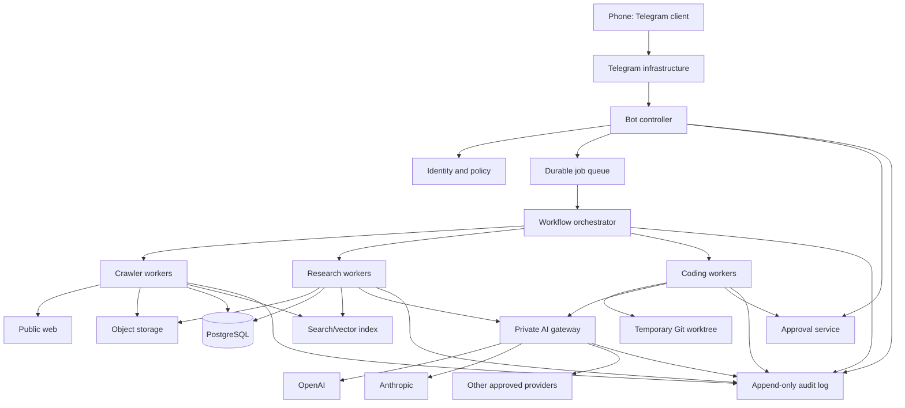

# Secure Agentic Crawler Engineering Playbook

**Status:** Draft team standard  
**Audience:** Developers, operators, reviewers, and coding agents  
**Scope:** Telegram-controlled crawling, research, and coding workflows using multiple AI providers  
**Core rule:** Interfaces may request capabilities; only the owning service may possess the corresponding master credential.

---

## 1. Purpose

This playbook converts the project from a collection of loosely connected scripts into a coherent, reviewable system.

It establishes:

- A secure architecture for Telegram commands, crawling, research, and coding agents.
- Clear trust boundaries and credential ownership.
- Shared software-engineering practices distilled from official Microsoft and Apple guidance.
- Additional engineering controls required for probabilistic AI agents.
- A repeatable workflow for humans, Codex, Claude, and other coding agents.
- A definition of done that includes security, testing, evaluation, and operational readiness.

This guide does **not** assume that a local coding agent can be trusted to protect a secret that it can read. Security comes from capability separation, process isolation, short-lived credentials, and policy enforcement—not from prompts.

---

## 2. System principles

### 2.1 Deterministic code owns authority

Use ordinary deterministic code for:

- Authentication and authorization.
- Budget and quota enforcement.
- URL and input validation.
- State transitions.
- Idempotency.
- Approval verification.
- Database constraints.
- Secret retrieval.
- Network policy.
- Deployment decisions.

Use an AI model for:

- Interpreting an ambiguous request.
- Selecting from explicitly permitted tools.
- Planning bounded work.
- Extracting and synthesizing information.
- Drafting code or reports.
- Proposing a change for review.

A model may recommend an action. It must not be the final authority on whether the action is permitted.

### 2.2 One owner for every responsibility

Every system concern must have one clearly named owner.

| Concern | Owning component |
|---|---|
| Telegram authentication | Bot controller |
| User authorization | Bot controller / identity service |
| Job lifecycle | Orchestrator |
| Crawl policy | Crawler service |
| Raw content storage | Object store |
| Metadata and canonical state | PostgreSQL |
| Search and retrieval | Index service |
| Model-provider credentials | AI gateway |
| Tool authorization | Tool service |
| Code execution | Isolated coding worker |
| Human approval | Approval service |
| Audit history | Append-only audit store |
| Deployment | CI/CD system |

Do not duplicate ownership in prompts, Telegram handlers, and model instructions. Prompts describe behavior; services enforce policy.

### 2.3 Start with one orchestrator

Use one orchestrator until separate agents are justified by:

- Different permissions.
- Different data access.
- Different evaluation criteria.
- Different failure isolation.
- Different context requirements.
- Different operational owners.

Do not create multiple agents merely because several roles can be named.

### 2.4 Capabilities instead of master secrets

A component receives only the capability needed for its current job.

Examples:

- The Telegram controller receives a token that can create and inspect its own jobs.
- A crawler receives a signed crawl lease restricted to specified domains and limits.
- A research worker receives read access to selected document IDs.
- A coding worker receives a temporary worktree and a task-scoped repository token.
- The AI gateway alone possesses model-provider credentials.
- A deployment worker receives a one-time approval-bound release capability.

---

## 3. Reference architecture



### 3.1 Credential ownership

| Component | Telegram bot token | Gateway capability | Provider API keys | Repository write token |
|---|---:|---:|---:|---:|
| Phone | No | No | No | No |
| Telegram infrastructure | Platform-managed | No | No | No |
| Bot controller | Yes | Limited | No | No |
| Orchestrator | No | Limited | No | No |
| Crawler | No | Usually no | No | No |
| Research worker | No | Task-scoped | No | No |
| Coding worker | No | Task-scoped | No | Task-scoped |
| AI gateway | No | Validates | Yes | No |
| CI/CD | No | Optional | No | Environment-scoped |

The Telegram message must never contain a provider key, repository token, SSH key, or cloud credential.

---

## 4. Trust boundaries and threat model

Assume the following inputs are hostile:

- Telegram messages.
- Crawled pages.
- HTML metadata.
- PDF contents.
- Search snippets.
- Model output.
- Tool output.
- Generated source code.
- Repository files modified by an agent.
- Dependency metadata.
- Webhook requests.
- URLs and redirects.

### 4.1 Primary threats

1. **Prompt injection:** A crawled page instructs the model to reveal data or invoke tools.
2. **Credential theft:** An agent reads environment variables, files, shell history, process memory, or mounted credentials.
3. **Server-side request forgery:** A supplied URL targets localhost, cloud metadata, private networks, or internal services.
4. **Arbitrary command execution:** Telegram text or model output is interpolated into a shell.
5. **Privilege escalation:** A low-trust worker reaches write or deployment capabilities.
6. **Duplicate side effects:** Retries create repeated posts, charges, commits, or deployments.
7. **Approval substitution:** A user approves one artifact, but a different artifact is executed.
8. **Unbounded cost:** Recursive agents, excessive crawling, or repeated model calls consume resources.
9. **Data leakage:** Sensitive source material or code is returned through Telegram or included in model context.
10. **Supply-chain compromise:** A generated dependency or package is malicious, abandoned, or incorrectly named.

### 4.2 Required countermeasures

- Deny by default.
- Validate at every trust boundary.
- Use typed request and response schemas.
- Resolve and validate target IP addresses before every fetch and after redirects.
- Prohibit shell interpolation.
- Use temporary, isolated workers.
- Use task-scoped and expiring credentials.
- Bind approvals to immutable hashes.
- Add hard budgets outside the model.
- Record complete decision and tool traces with secret redaction.
- Treat model output as a proposal until deterministic validation succeeds.

---

## 5. Telegram is a control surface, not a trusted runtime

Telegram may submit requests and receive sanitized status updates. It must not:

- Store model-provider keys.
- Execute arbitrary shell commands.
- Receive full environment dumps.
- Return sensitive datasets.
- Return unrestricted source archives.
- Act as the canonical job database.
- Decide whether an operation is authorized.

### 5.1 Approved command model

Use a small, versioned command surface:

```text
/crawl <url> [--depth N] [--pages N]
/research <crawl-job-id> <question>
/code <provider> <repository> <task>
/status <job-id>
/results <job-id>
/cancel <job-id>
/approve <approval-id>
/reject <approval-id>
```

Telegram text is parsed into a typed request:

```json
{
  "schema_version": 1,
  "request_type": "crawl",
  "target_url": "https://example.com/docs",
  "limits": {
    "maximum_depth": 2,
    "maximum_pages": 200
  },
  "requested_by": "telegram-user:12345"
}
```

Do not expose `/shell`, `/exec`, or a generic command that forwards text directly to a terminal.

### 5.2 Authentication and replay protection

The bot controller must:

- Validate Telegram's webhook secret.
- Permit only configured user IDs and approved chat types.
- Generate a request ID for each accepted update.
- Reject duplicate update IDs.
- Apply per-user and global rate limits.
- Store the normalized request before acknowledging it.
- Avoid logging bot tokens, authorization headers, or message contents classified as sensitive.

---

## 6. AI gateway

The gateway is the only component that holds provider API keys.

### 6.1 Gateway responsibilities

- Authenticate calling workloads.
- Authorize model, endpoint, and operation.
- Apply hard request, token, and cost limits.
- Redact secrets from logs.
- Attach trace and job identifiers.
- Normalize provider-specific APIs.
- Enforce data-routing rules.
- Reject unsupported tool calls.
- Track spend by project, user, workflow, and provider.
- Rotate provider credentials without changing downstream services.
- Issue or validate short-lived job capabilities.

### 6.2 Capability claims

A gateway capability should include claims similar to:

```json
{
  "subject": "research-worker:instance-42",
  "job_id": "job_01J...",
  "allowed_operations": ["responses.create"],
  "allowed_models": ["approved-small", "approved-large"],
  "maximum_input_tokens": 120000,
  "maximum_output_tokens": 12000,
  "maximum_cost_usd": 2.00,
  "expires_at": "2026-07-20T23:59:00Z",
  "audience": "ai-gateway"
}
```

Never place the permanent provider credential in this token.

### 6.3 Failure policy

The gateway must fail closed when:

- The budget is exhausted.
- The capability is expired.
- The requested model is not allowed.
- Required trace metadata is absent.
- The request contains a prohibited data classification.
- The provider response attempts an unsupported action.
- The caller exceeds concurrency or rate limits.

---

## 7. Crawler design

### 7.1 Pipeline

```text
discover
→ validate target
→ schedule
→ fetch
→ validate response
→ extract
→ canonicalize
→ deduplicate
→ classify
→ store raw content
→ store normalized content
→ index
→ evaluate crawl quality
```

### 7.2 Fetch policy

Each crawl job declares:

- Allowed domains and subdomains.
- Maximum pages.
- Maximum depth.
- Maximum response size.
- Maximum redirects.
- Allowed content types.
- Per-domain concurrency.
- Minimum request delay.
- Overall deadline.
- Retention period.
- Whether JavaScript rendering is permitted.

Respect applicable site terms, access controls, `robots.txt`, rate limits, and `Retry-After`. Do not bypass authentication, CAPTCHAs, paywalls, or technical access controls.

### 7.3 SSRF controls

For each initial URL and redirect:

1. Parse using a standards-compliant URL parser.
2. Permit only approved schemes.
3. Normalize hostnames.
4. Resolve DNS.
5. Reject loopback, link-local, multicast, private, carrier-grade NAT, and metadata-service ranges.
6. Connect only to the validated address.
7. Verify the TLS hostname.
8. Revalidate every redirect.
9. Enforce response size and timeout limits.

A hostname string check is insufficient because of DNS rebinding and alternate IP representations.

### 7.4 Content storage

Store immutable raw content and derived normalized content separately.

Suggested records:

```text
crawl_job
crawl_target
fetch_attempt
document
document_version
content_blob
extracted_section
source_reference
index_entry
crawl_policy_decision
```

Each document version should include:

- Original URL.
- Final URL.
- Retrieval timestamp.
- HTTP status.
- Content type.
- Content hash.
- Extraction version.
- Canonical URL.
- Parent/referrer URL.
- Source job ID.
- Data classification.
- Retention policy.

### 7.5 Prompt-injection isolation

The crawler never follows instructions found in content.

The research model receives content in a clearly marked untrusted-data field. Tool-capable agents should not simultaneously have:

- Unrestricted shell access.
- Home-directory access.
- Production credentials.
- Arbitrary outbound network access.
- Deployment capability.

A page may be evidence. It is never policy.

---

## 8. Research and retrieval design

Do not send an entire crawl corpus to a model.

Use:

```text
query analysis
→ metadata filtering
→ full-text/vector retrieval
→ reranking
→ context assembly
→ model synthesis
→ citation verification
→ quality evaluation
```

### 8.1 Retrieval contract

Every context item must contain:

```json
{
  "document_id": "doc_...",
  "section_id": "section_...",
  "source_url": "https://...",
  "retrieved_at": "2026-07-20T...",
  "content_hash": "sha256:...",
  "text": "...",
  "trust_level": "untrusted-public-web"
}
```

### 8.2 Research output contract

Require structured output:

```json
{
  "answer": "...",
  "claims": [
    {
      "claim": "...",
      "supporting_section_ids": ["section_1", "section_8"],
      "confidence": 0.82
    }
  ],
  "uncertainties": ["..."],
  "conflicts": ["..."],
  "recommended_follow_up": ["..."]
}
```

A deterministic postprocessor must verify that referenced sections exist and belong to the current job.

---

## 9. Coding-agent design

Coding agents must operate as change proposers, not autonomous maintainers.

### 9.1 Standard workflow

```text
issue/task
→ inspect repository instructions
→ create isolated worktree
→ produce plan
→ implement smallest coherent change
→ run required checks
→ summarize risks and evidence
→ create patch/commit
→ request review
→ human approves immutable artifact
→ CI independently rebuilds and tests
→ merge
→ deployment follows separate policy
```

### 9.2 Isolation requirements

A coding worker receives:

- A temporary worktree or ephemeral repository clone.
- Only the repositories required for the task.
- No host home-directory mount.
- No SSH agent forwarding unless explicitly required and isolated.
- No Docker socket mount.
- No cloud credential directories.
- A sanitized process environment.
- A task-scoped model capability.
- A task-scoped repository token where needed.
- A network allowlist.
- CPU, memory, disk, time, and process limits.

### 9.3 Agent output requirements

Every coding result must include:

- Files changed.
- Behavioral change.
- Tests added or changed.
- Commands executed.
- Test and lint results.
- Remaining uncertainties.
- Security implications.
- Migration or rollback notes.
- Dependency changes.
- An immutable commit or patch hash.

### 9.4 No self-approval

The same agent may not:

- Propose a change.
- Approve that change.
- Merge it.
- Deploy it.
- Declare deployment successful without independent evidence.

---

## 10. Shared engineering practices

The following rules distill official Microsoft and Apple guidance into project-level requirements. They are not claims that an individual Microsoft or Apple engineer personally reviewed this project.

### 10.1 Clarity at the point of use

Apple's Swift API Design Guidelines emphasize clarity where an API is used and place clarity above brevity. Apply this across all languages:

```python
# Preferred
approve_artifact(approval_id=approval_id, expected_sha256=artifact_hash)

# Avoid
do_it(x, h)
```

Names should communicate role and side effect.

- Queries should read like queries: `get_job_status`.
- Commands should read like commands: `cancel_job`.
- Dangerous operations should say what they do: `delete_crawl_artifacts`.
- Avoid vague names such as `handle`, `process`, `manage`, and `run` unless the scope is obvious.
- Avoid abbreviations that are not established domain terms.
- Document public APIs and non-obvious invariants.

### 10.2 Small, reviewable pull requests

Microsoft's Engineering Fundamentals Playbook recommends changes to the main codebase through pull requests, supporting inspection and automated qualification.

Project rule:

- One coherent purpose per pull request.
- Prefer changes that can be reviewed in one sitting.
- Separate refactoring from behavior changes where practical.
- Include tests and documentation in the same pull request as the behavior.
- Explain why the change exists, not only what changed.
- Link the task, design decision, or incident.
- Address every review comment or record why it is not applicable.

### 10.3 Protected main branch

- No direct pushes to `main`.
- Require pull requests.
- Require passing CI.
- Require at least one independent reviewer for ordinary changes.
- Require security or owner review for trust-boundary changes.
- Require approval for dependency, authentication, authorization, gateway, crawler-policy, and deployment changes.
- Use CODEOWNERS or an equivalent ownership mechanism.

### 10.4 Design before irreversible implementation

For cross-component or security-sensitive work, add a short design document before implementation.

A design record must include:

- Problem and non-goals.
- Constraints.
- Proposed components and ownership.
- Trust boundaries.
- Alternatives considered.
- Failure modes.
- Migration and rollback.
- Testing and observability.
- Security and privacy impact.
- Decision and review date.

Store design records in source control and review them through pull requests.

### 10.5 Security throughout the lifecycle

Microsoft's Security Development Lifecycle treats security and privacy as lifecycle activities rather than final checks.

Required activities:

- Threat-model new trust boundaries.
- Define security requirements in the task.
- Scan dependencies and containers.
- Scan commits and CI output for secrets.
- Run static analysis.
- Validate authorization at service boundaries.
- Test negative and abuse cases.
- Record and remediate security findings.
- Maintain an incident and credential-rotation procedure.

### 10.6 Secrets outside source and outside untrusted workers

- Assume every repository may eventually become public.
- Never commit a real secret.
- Prefer workload identity and short-lived credentials.
- Otherwise use an external secret manager.
- Do not mount secret stores into coding or crawler workers.
- Never print environment variables in logs.
- Rotate a secret immediately after suspected exposure.
- Separate development, staging, and production identities.
- Restrict credentials by operation, resource, time, and environment.

On Apple platforms, use Keychain Services for small app-held secrets. Keychain protects storage; it does not make a secret safe from a process that has been deliberately granted access to retrieve it.

### 10.7 Tests are part of the design

Use a layered test strategy:

1. **Unit tests:** parsers, validators, policy decisions, state transitions.
2. **Contract tests:** service schemas, provider adapters, queue messages.
3. **Integration tests:** database, queue, object store, gateway, crawler.
4. **Security tests:** SSRF, injection, authorization, replay, secret leakage.
5. **Agent evaluations:** task completion, tool correctness, citation fidelity, refusal behavior.
6. **End-to-end tests:** Telegram request through sanitized result.
7. **Release tests:** production-like configuration without production credentials.

Code coverage is diagnostic evidence, not the goal. Tests must target risks and invariants.

### 10.8 Observable by design

Record:

- Request/job/trace IDs.
- State transitions.
- Policy decisions.
- Tool calls and results.
- Model/provider/model-version metadata.
- Token and cost usage.
- Retrieval document IDs.
- Approval IDs and artifact hashes.
- Queue latency.
- Worker execution time.
- Retry count.
- Crawler response distributions.
- Evaluation results.

Never log:

- Provider keys.
- Telegram bot tokens.
- Repository tokens.
- Raw authorization headers.
- Full environment variables.
- Unredacted sensitive prompts or documents.

Apple's unified logging guidance supports structured, centralized telemetry; use privacy-aware fields and avoid treating logs as secret storage.

### 10.9 Explicit error handling

- Use typed/domain-specific errors.
- Distinguish retryable from terminal failures.
- Include a stable machine-readable error code.
- Preserve causal chains internally.
- Return sanitized errors externally.
- Apply bounded retries with jitter.
- Never retry non-idempotent actions without an idempotency key.
- Send failed jobs to a dead-letter path after retry exhaustion.

### 10.10 Performance and resource discipline

- Set explicit deadlines for network, model, and tool calls.
- Limit response sizes.
- Bound concurrency per worker and per target domain.
- Cache immutable content by hash.
- Deduplicate before embedding.
- Prefer metadata/full-text filtering before vector retrieval.
- Use the smallest model that meets the evaluated quality target.
- Record cost and latency regressions in pull requests.

---

## 11. AI-agent-specific engineering practices

Traditional tests are necessary but insufficient because agent behavior is probabilistic and context-dependent.

### 11.1 Specify the agent as a contract

Each agent must have a versioned specification:

```yaml
id: research_synthesizer
version: 3
purpose: Synthesize answers from retrieved project documents.
allowed_tools:
  - retrieve_sections
  - inspect_document_metadata
prohibited_actions:
  - arbitrary_network
  - shell
  - repository_write
inputs:
  schema: ResearchRequestV2
outputs:
  schema: ResearchReportV3
limits:
  maximum_turns: 8
  maximum_tool_calls: 20
  maximum_cost_usd: 1.50
exit_conditions:
  - valid_report
  - insufficient_evidence
  - budget_exhausted
```

### 11.2 Version everything that affects behavior

Version and trace:

- System instructions.
- Prompt templates.
- Tool schemas.
- Agent policies.
- Model and provider.
- Retrieval strategy.
- Chunking and reranking.
- Evaluation dataset.
- Guardrail configuration.
- Output schema.

A behavior change without a version change is an observability defect.

### 11.3 Tools must be narrow and typed

Preferred:

```text
create_ticket_draft(customer_id, title, description)
```

Avoid:

```text
execute_arbitrary_sql(query)
run_shell(command)
http_request(url, method, headers, body)
```

Every tool must:

- Validate authorization independently.
- Validate input independently.
- Enforce timeouts and resource limits.
- Return a typed result.
- Avoid returning unnecessary sensitive data.
- Declare whether it has side effects.
- Support idempotency where applicable.
- Emit an audit event.

### 11.4 Separate read, propose, and execute

Use three capability levels:

1. **Read:** inspect state.
2. **Propose:** create a draft, plan, patch, or approval request.
3. **Execute:** perform a consequential side effect.

Agents should receive read and propose capabilities by default. Execute capabilities require narrowly scoped policy and, where appropriate, human approval.

### 11.5 Hard stop conditions

The orchestrator—not the model—must enforce:

- Maximum turns.
- Maximum tool calls.
- Maximum wall-clock time.
- Maximum tokens.
- Maximum cost.
- Maximum retries.
- Maximum generated artifacts.
- Maximum crawl scope.

When a limit is reached, return a typed incomplete result rather than silently continuing.

### 11.6 Evaluate trajectories, not only final prose

An apparently correct answer can result from unsafe or incorrect actions.

Evaluate:

- Was the correct tool selected?
- Were tool arguments correct?
- Was authorization respected?
- Were unnecessary tools avoided?
- Were citations attached to supported claims?
- Were conflicting sources surfaced?
- Did the agent stop at the correct time?
- Did it avoid prohibited data and actions?
- Did it request approval when required?
- Was the final result useful?

### 11.7 Maintain a regression evaluation set

Keep representative cases in source control:

```text
evals/
├── crawl_policy/
├── prompt_injection/
├── research_citations/
├── coding_tasks/
├── approval_flow/
├── authorization/
└── cost_latency/
```

Each case should contain:

- Input.
- Permitted context.
- Expected invariants.
- Forbidden actions.
- Scoring rubric.
- Required citations or tool calls.
- Maximum cost and latency where relevant.

Run critical evaluations in CI and a broader suite before release.

### 11.8 Do not treat model confidence as calibrated truth

Use confidence as explanatory metadata only unless calibration has been evaluated for the exact task and distribution.

Prefer concrete evidence:

- Source references.
- Tool receipts.
- Test output.
- Policy decisions.
- Artifact hashes.
- Independent verification.

### 11.9 Model-provider independence

Define an internal interface:

```python
class ModelGateway:
    async def generate(self, request: ModelRequest) -> ModelResponse:
        ...
```

Provider adapters handle:

- Authentication.
- Provider-specific request/response mapping.
- Retry semantics.
- Streaming.
- Tool-call normalization.
- Usage reporting.
- Error translation.

Business workflows must not depend directly on provider response objects.

### 11.10 One shared repository instruction file

Keep an `AGENTS.md` in the repository root. All coding agents must read it before modifying code.

It should define:

- Repository structure.
- Architectural boundaries.
- Commands.
- Tests.
- Style.
- Security restrictions.
- Definition of done.
- Files that require owner review.
- Prohibited actions.

This reduces contradictory behavior between Codex, Claude, and other tools.

---

## 12. Repository structure

```text
.
├── AGENTS.md
├── README.md
├── CONTRIBUTING.md
├── SECURITY.md
├── docs/
│   ├── architecture/
│   ├── decisions/
│   ├── runbooks/
│   └── threat-models/
├── contracts/
│   ├── commands/
│   ├── events/
│   └── api/
├── services/
│   ├── bot-controller/
│   ├── orchestrator/
│   ├── crawler/
│   ├── research-worker/
│   ├── coding-worker/
│   ├── ai-gateway/
│   └── approval-service/
├── libraries/
│   ├── auth/
│   ├── policy/
│   ├── telemetry/
│   └── schemas/
├── evals/
├── tests/
├── infrastructure/
└── scripts/
```

### 12.1 Boundary rule

A service may depend on shared libraries and published contracts. It must not import another service's internal modules.

Cross-service communication occurs through:

- Versioned APIs.
- Versioned queue events.
- Immutable object references.
- Explicit database ownership.

Avoid a shared database schema with unrestricted cross-service writes.

---

## 13. State-machine model

Jobs should use explicit transitions:

```text
RECEIVED
→ VALIDATED
→ QUEUED
→ RUNNING
→ WAITING_FOR_APPROVAL
→ SUCCEEDED

Any active state
→ CANCELLING
→ CANCELLED

Any active state
→ FAILED_RETRYABLE
→ QUEUED

Any active state
→ FAILED_TERMINAL
```

Rules:

- Transitions are atomic.
- Invalid transitions are rejected.
- Every transition records actor, reason, timestamp, and trace ID.
- Side effects use an idempotency key derived from job and step.
- A worker lease expires and can be recovered.
- Completion is based on persisted evidence, not a worker's natural-language claim.

---

## 14. Approval design

An approval request must bind:

```json
{
  "approval_id": "approval_...",
  "job_id": "job_...",
  "operation": "merge_commit",
  "artifact_uri": "object://artifacts/...",
  "artifact_sha256": "sha256:...",
  "repository": "org/project",
  "target_branch": "main",
  "requested_at": "...",
  "expires_at": "...",
  "requested_by": "coding-worker:...",
  "required_approver_role": "maintainer"
}
```

Approval execution must verify:

- The approval is unused and unexpired.
- The approver is authorized.
- The artifact hash matches.
- The target has not changed incompatibly.
- Required CI checks pass.
- The exact approved action is being executed.

---

## 15. CI/CD policy

Every pull request must run:

- Formatting.
- Linting.
- Type checking.
- Unit tests.
- Contract validation.
- Secret scanning.
- Dependency scanning.
- Static security analysis.
- Agent-policy validation.
- Critical agent evaluations.
- Build/package validation.

Protected or release branches additionally run:

- Integration tests.
- Container scanning.
- Infrastructure validation.
- Migration checks.
- Broader agent evaluations.
- Cost and latency checks.
- Staging deployment and smoke tests.

Production deployment is separate from merge approval.

---

## 16. Definition of done

A change is done only when all applicable items are true.

### Product and design

- Acceptance criteria are explicit.
- Non-goals are recorded.
- User-visible behavior is documented.
- Cross-component changes have a reviewed design record.

### Code

- Names communicate intent and side effects.
- Interfaces and events are typed and versioned.
- The implementation is the smallest coherent solution.
- No duplicated policy logic was added.
- Errors are typed and actionable.
- Timeouts, limits, and cancellation are handled.

### Security

- Trust-boundary changes have a threat-model update.
- Authorization occurs at the owning service.
- No new master credential is exposed.
- Logs and traces redact sensitive data.
- SSRF, injection, and replay risks are addressed.
- Dependencies are justified and scanned.

### Testing and evaluation

- Unit and integration tests cover success and failure paths.
- Agent evaluations cover relevant trajectories.
- Tests reproduce the fixed defect where applicable.
- Required checks pass independently in CI.
- Cost and latency remain within budget.

### Operations

- Metrics, logs, and traces exist.
- Alerts or dashboards are updated where needed.
- Migration and rollback are documented.
- Runbooks cover new failure modes.
- Data retention and cleanup are defined.

### Review

- Pull request description explains intent, evidence, and risk.
- Required owners reviewed the change.
- Generated code was reviewed as untrusted code.
- Approval is attached to the immutable artifact being executed.

---

## 17. First implementation milestones

### Milestone 1: Secure command intake

- Telegram webhook authentication.
- User allowlist.
- Typed `/crawl` command.
- Durable job storage.
- Status command.
- No model integration.

### Milestone 2: Bounded crawler

- URL and SSRF validation.
- Domain policy.
- Rate limiting.
- Raw and normalized storage.
- Content hashing and deduplication.
- Crawl metrics.

### Milestone 3: Research

- Full-text retrieval.
- Structured research request and report.
- Gateway integration using task capabilities.
- Citation verification.
- Initial regression evaluations.

### Milestone 4: Coding worker

- Ephemeral worktree.
- Shared `AGENTS.md`.
- Provider-neutral coding-agent adapter.
- Tests and diff generation.
- No merge or deployment capability.

### Milestone 5: Approval and release

- Immutable artifact storage.
- Telegram approval notification.
- Independent approval service.
- CI verification.
- Separate merge and deployment policies.

---

## 18. Pull request template

```markdown
## Purpose

What problem does this solve?

## Scope

What changed, and what is intentionally unchanged?

## Architecture and contracts

Which components, trust boundaries, APIs, or events changed?

## Security

- Threats considered:
- Permissions added or changed:
- Secret handling:
- Data classification:

## Evidence

- Tests:
- Agent evaluations:
- Manual checks:
- Performance/cost measurements:

## Operations

- Telemetry:
- Migration:
- Rollback:
- Runbook updates:

## Agent-generated work

- Agent/provider used:
- Human-reviewed files:
- Commands independently rerun:
- Remaining uncertainty:
```

---

## 19. Decision rules for the team

When uncertain:

1. Choose the design with the smaller trust boundary.
2. Prefer an explicit contract over an implicit convention.
3. Prefer a task-scoped capability over a reusable credential.
4. Prefer a deterministic check over a prompt instruction.
5. Prefer one agent over multiple agents.
6. Prefer a proposal over an autonomous side effect.
7. Prefer an immutable artifact over mutable shared state.
8. Prefer a small reviewed change over a broad generated rewrite.
9. Prefer evidence over model confidence.
10. Stop and record uncertainty rather than inventing system behavior.

---

## 20. Official source material

### Microsoft

- [Engineering Fundamentals Playbook](https://microsoft.github.io/code-with-engineering-playbook/)
- [Code Reviews](https://microsoft.github.io/code-with-engineering-playbook/code-reviews/)
- [Pull Requests](https://microsoft.github.io/code-with-engineering-playbook/code-reviews/pull-requests/)
- [Source Control](https://microsoft.github.io/code-with-engineering-playbook/source-control/)
- [Secrets Management](https://microsoft.github.io/code-with-engineering-playbook/CI-CD/dev-sec-ops/secrets-management/)
- [Microsoft Security Development Lifecycle](https://learn.microsoft.com/en-us/compliance/assurance/assurance-microsoft-security-development-lifecycle)
- [AI Agent Orchestration Patterns](https://learn.microsoft.com/en-us/azure/architecture/ai-ml/guide/ai-agent-design-patterns)
- [Observability in Generative AI](https://learn.microsoft.com/en-us/azure/foundry/concepts/observability)
- [Responsible AI for Microsoft Foundry](https://learn.microsoft.com/en-us/azure/foundry/responsible-use-of-ai-overview)

### Apple and Swift

- [Swift API Design Guidelines](https://swift.org/documentation/api-design-guidelines/)
- [Apple Security Framework](https://developer.apple.com/documentation/security/)
- [Apple Keychain Services](https://developer.apple.com/documentation/security/keychain-services)
- [Apple Xcode Testing](https://developer.apple.com/documentation/xcode/testing)
- [Apple Logging](https://developer.apple.com/documentation/os/logging)
- [Apple Secure Coding Guide](https://developer.apple.com/library/archive/documentation/Security/Conceptual/SecureCodingGuide/Introduction.html)

### OpenAI agent engineering

- [A Practical Guide to Building AI Agents](https://openai.com/business/guides-and-resources/a-practical-guide-to-building-ai-agents/)
- [OpenAI Agents SDK](https://developers.openai.com/api/docs/guides/agents)
- [AGENTS.md and the Agentic AI Foundation](https://openai.com/index/agentic-ai-foundation/)

---

## 21. Final architectural statement

The project is not “a Telegram bot that can run AI.”

It is a set of independently governed services:

- Telegram authenticates and requests.
- The controller validates and records.
- The orchestrator coordinates.
- The crawler acquires untrusted data.
- Retrieval selects evidence.
- Models interpret and propose.
- Tools enforce permissions.
- The gateway protects provider credentials and budgets.
- Humans approve consequential artifacts.
- CI/CD independently verifies and releases.
- Audit records explain what happened.

No single agent, prompt, worker, or chat interface should possess enough authority to crawl arbitrary targets, read private files, spend without limits, modify source, merge code, and deploy production.
